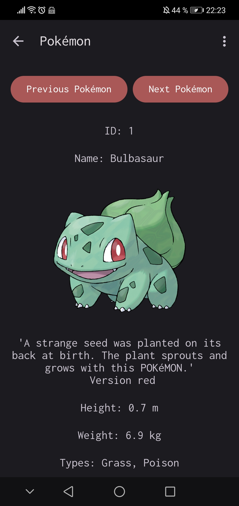

# Poke-App von Isabell Noack

Projektstart: 18.10.2023, Projektende: 25.01.2024

Das Projekt ist im Zusammenhang mit dem Modul Mobile Apps Entwicklung entstanden.

Ziel war die Erstellung einer Mobile Android Applikation zum Aufrufen und detaillierten Einsehen von Daten (ich wählte konkret Pokémon).
Ich war zu Start des Projektes selbst noch kompletter Programmier-Anfänger.

